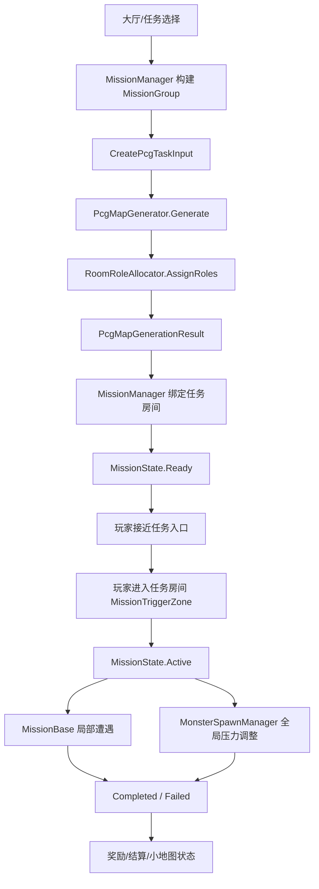

# 任务系统触发与刷怪联动编排

> 状态：Proposed / 待审核  
> 日期：2026-06-27  
> 关联模块：MissionSystem、PCG、SpawnSystem、UI 小地图、RunSystem  
> 前置条件：小地图静态地形层、房间角色图标与运行时动态标记能力已完成

## 背景

当前项目已经具备任务系统的主体骨架：

- `MissionManager` 可从 `MissionLibrary` 构建 `1 主 + N 次` 任务组，并通过 `MissionGroupRuntimeData.CreatePcgTaskInput()` 把任务语义传给 PCG。
- `RoomRoleAllocator` 已根据 `MapTaskInput` 分配 `RoomRole.Boss`、`SideElimination`、`SideDefense`、`SideCapture`、`SideDestroy`，并输出 `TaskTriggerConnection`。
- `MissionManager` 已能在地图生成后创建 `MissionBase` 运行时实例和 `MissionTriggerZone`，任务状态通过 `NetworkList<MissionNetState>` 同步。
- `MonsterSpawnManager` 已按玩家所在区域、玩家人数、活跃支线任务数、难度等级与 `PcgGenerationProfile.AvailableEnemies` 驱动全局刷怪。
- 小地图已可基于 PCG 结果显示地图地形、房间角色图标、玩家/敌人动态标记。

主要缺口是：任务房间绑定仍通过遍历 Graph 反查；任务触发缺少统一的“接近/进入/交互/完成”分层；任务对刷怪的影响分散在任务自身刷怪和 `MonsterSpawnManager` 活跃任务倍率中；小地图与任务指引之间还没有统一呈现策略。

## 决策

任务系统采用“任务编排层 + 全局刷怪层 + 局部遭遇层”三层模型：

1. `MissionManager` 只负责任务组、任务状态、触发区、任务实例和网络同步。
2. `MissionBase` 子类只负责本任务的局部遭遇，例如 Boss、歼灭怪、防御目标、捕获点、破坏目标。
3. `MonsterSpawnManager` 继续负责开放地图的全局环境刷怪，但从任务系统读取一个只读的任务压力快照，决定刷怪容量、频率、区域权重和屏蔽区域。

不让 Mission 直接控制全局刷怪循环；不让 MonsterSpawnManager 了解具体任务细节。两者通过小而稳定的数据快照通信。

## 总体流程



## 任务房间绑定

后续实现应优先使用 `PcgMapGenerationResult.TaskTriggerConnections` 回填 `MissionNetState.RoomNodeId`。

当前方式：

```text
MissionManager.ResolveMissionRoomsAgainstMap()
  -> FindMissionRoomNode(missionType)
  -> 遍历 Graph 节点匹配 AssignedRole / AssignedSideTask
```

目标方式：

```text
MissionManager.ResolveMissionRoomsAgainstMap()
  -> 读取 CurrentMapResult.TaskTriggerConnections
  -> TaskRole 反查 MissionType
  -> TaskNodeId 写入 MissionNetState.RoomNodeId
  -> ConnectedNodeId 记录为推荐入口/触发来源
```

Boss 房间当前没有 `TaskTriggerConnection`，因此 Boss 仍可保留 `RoomRole.Boss` 兜底查找。支线任务必须优先走 `TaskTriggerConnection`，这样 MissionSystem 与 PCG 的任务语义保持一致，也方便小地图显示“推荐入口”。

## 触发分层

任务触发拆成四层，不把所有行为都塞进 `OnTriggerEnter`。

| 层级 | 触发源 | 状态影响 | 用途 |
|------|--------|----------|------|
| 接近触发 | `TaskTriggerConnection.ConnectedNodeId` 对应连接房 / 门 | 不改变 `MissionState` | 小地图高亮、指引器切换、预警提示 |
| 进入触发 | `MissionTriggerZone.OnTriggerEnter` | `Ready -> Active` | 正式激活任务，开始刷局部遭遇 |
| 交互触发 | 任务目标组件，例如捕获点、破坏目标、防御目标 | 推进进度或失败 | Capture / Destroy / Defense 的目标行为 |
| 事件触发 | `EventCenter.UnitDied`、目标销毁回调、倒计时 | `Active -> Completed/Failed` | Boss/Eliminate 击杀、防御倒计时、目标死亡 |

Phase 1 不新增 `MissionState.Discovered`。接近触发只作为本地 UI 表现和引导数据，避免扩大网络状态机。若后续需要多人共享“已发现任务”，再新增 `Discovered` 状态。

## 刷怪联动

刷怪分为两类：

| 类型 | 归属 | 行为 |
|------|------|------|
| 局部任务遭遇 | `MissionBase` 子类 | 激活任务后按 `MissionConfig.SpawnEntries` 或目标配置生成并追踪任务单位 |
| 全局环境刷怪 | `MonsterSpawnManager` | 开放地图持续刷怪，按玩家位置和任务压力调整 |

### 任务压力快照

建议由 `MissionManager` 暴露只读快照，例如：

```csharp
public readonly struct MissionSpawnInfluenceSnapshot
{
    public int ActiveSideTaskCount;
    public int ActivePrimaryTaskCount;
    public IReadOnlyList<int> ActiveMissionRoomNodeIds;
    public IReadOnlyList<int> SuppressedRoomNodeIds;
    public float CapMultiplier;
    public float RateMultiplier;
}
```

`MonsterSpawnManager` 每个 FixedUpdate 读取快照，而不是直接遍历任务并判断任务类型。现有 `_activeTaskCount`、`ComputeCapTaskMultiplier()`、`ComputeRateTaskMultiplier()` 可作为 Phase 1 保留实现，后续收敛到快照接口。

### 刷怪规则

1. 环境怪默认不在玩家当前房间刷出，继续使用距离权重。
2. 任务房间激活后，局部任务怪由 `MissionBase` 生成，环境刷怪不抢占任务房间刷怪点。
3. 活跃支线任务提高全局刷怪压力：首个任务提高容量和频率，后续任务递增但设置上限。
4. Boss 激活后应抑制非 Boss 房间的过量刷怪，避免 Boss 战被环境怪噪声淹没。具体做法是 `ActivePrimaryTaskCount > 0` 时降低环境刷怪倍率或屏蔽 Boss 相邻区域。
5. `PcgGenerationProfile.AvailableEnemies` 仍是环境怪的敌人池；`MissionConfig.SpawnEntries` 是任务专属敌人池，二者互不覆盖。
6. 若任务配置中的 `EnemyId` 不在当前 Style 的 `AvailableEnemies` 中，任务专属刷怪仍允许生成，因为任务可以要求特殊敌人。该情况需要在调试日志中提示策划确认。

## 小地图与任务指引

小地图负责“空间认知”，`MissionPointerManager` 负责“屏幕边缘方向”。两者不互相替代。

Phase 1：

- 小地图继续显示 `RoomRole` 图标，用于让玩家知道功能房大致位置。
- `MissionPointerManager` 继续显示当前任务方向和状态文本。
- 进入任务房间后，指引器从“下一扇门”切换到“任务目标点”。

Phase 2：

- 在 `MinimapView` 动态标记层新增任务标记，数据来自 `MissionManager.RuntimeMissions` 或任务状态同步列表。
- 标记状态区分 `Ready`、`Active`、`Completed`、`Failed`。
- 接近触发后高亮推荐入口 `ConnectedNodeId`，进入任务房后高亮 `RoomNodeId`。

需要人工确认：

- 小地图任务图标资源是否按任务类型配置在 `PcgStyleOptions.MinimapIcons`，还是单独建立 Mission 图标表。
- `GameHUDWindowDataComponent` / `MinimapView` 的 Inspector 绑定是否包含任务标记容器和标记 Prefab。

## 网络权威规则

1. `MissionState`、任务进度、任务房间绑定只在服务端写入。
2. 客户端可以触发进入/交互请求，但最终状态变化必须由服务端确认。
3. 若新增 `ServerRpc`，必须校验调用者权限或校验调用者对应玩家确实在触发范围内。
4. `NetworkList<MissionNetState>` 继续作为任务状态同步主通道。
5. `EventCenter` 只用于模块内外的运行时事件广播，不替代网络同步。

## 需要新增或调整的事件

建议补齐任务生命周期事件，供 HUD、结算、奖励、音效使用：

| 事件 | 触发时机 | 用途 |
|------|----------|------|
| `MissionStateChangedEvt` | `MissionBase.SetState()` 后由 `MissionManager.SyncMissionState()` 触发 | HUD、小地图、音效 |
| `MissionProgressChangedEvt` | 任务进度变化后 | HUD 进度条 |
| `MissionCompletedEvt` | `Completed` 首次同步 | 奖励、结算统计 |
| `MissionFailedEvt` | `Failed` 首次同步 | HUD、结算统计 |

事件只在服务端状态确定后触发；客户端 UI 仍以 `NetworkList` 或本地委托刷新为准，避免预测状态和同步状态不一致。

## 配置布置

### MissionConfig

现有字段继续作为任务基本配置：

- `missionId`、`displayName`、`missionType`、`missionCategory`
- `triggerOnRoomEnter`、`triggerHeight`、`pointerLabel`
- `spawnEntries`
- `objectivePrefab`
- `killTargetCount`、`defenseDurationSeconds`、`captureRequiredProgress`、`destroyRounds`
- `rewards`

建议后续新增一个可选分组：

```text
Spawn Influence
- ambientPolicy: None / IncreasePressure / SuppressAmbient / BossLockdown
- capMultiplierOverride
- rateMultiplierOverride
- suppressAmbientInMissionRoom
- suppressAmbientInAdjacentRooms
```

Phase 1 可先不加字段，继续使用 `MonsterSpawnConfig` 的全局任务倍率。等任务类型差异明确后再把差异下放到 `MissionConfig`。

### MonsterSpawnConfig

保留现有字段：

- `firstTaskCapMultiplier`
- `additionalTaskCapMultiplier`
- `firstTaskRateMultiplier`
- `additionalTaskRateMultiplier`
- 区域距离权重

建议新增上限保护：

- `maxTaskCapMultiplier`
- `maxTaskRateMultiplier`
- `bossFightAmbientRateMultiplier`

## 分阶段落地计划

### Phase 1：绑定与状态闭环

- `ResolveMissionRoomsAgainstMap()` 优先使用 `TaskTriggerConnections`。
- 保留 Boss Graph 兜底查找。
- 增加任务生命周期 EventCenter 事件。
- 确认 `MissionTriggerZone` 只负责进入触发，不承担接近提示。
- 文档同步：更新 MissionSystem MODULE。

验收标准：

- 同一 Seed 下任务房间绑定稳定。
- 支线任务房间与 PCG 分配结果一致。
- 任务状态变化能被 HUD/日志观察到。

### Phase 2：任务 UI 与小地图标记

- 小地图新增任务动态标记或任务房间高亮。
- `MissionPointerManager` 使用推荐入口数据，优先指向 `TaskTriggerConnection.ConnectedNodeId` 对应的下一扇门。
- 进入任务房后改指向任务目标点。

验收标准：

- 未进入任务房时，玩家能通过小地图和指引器找到入口。
- 进入任务房后，指引目标切换到目标对象或房间中心。
- 完成/失败任务在小地图和指引器上消失或变灰。

### Phase 3：刷怪压力接口

- 新增 `MissionSpawnInfluenceSnapshot`。
- `MonsterSpawnManager` 从快照读取活跃任务数、屏蔽房间、倍率。
- 任务房间内环境刷怪默认被抑制，任务怪由 `MissionBase` 负责。
- Boss 战期间降低环境刷怪干扰。

验收标准：

- 激活支线后全局环境怪压力上升。
- 任务房间不会被环境怪和任务怪双重刷爆。
- Boss 战期间环境刷怪不会明显干扰主战斗。

### Phase 4：任务奖励与结算

- `MissionBase.Complete()` 后按 `MissionConfig.Rewards` 发放局内或存档奖励。
- `RunSummaryCalculator` 读取任务完成/失败状态。
- `MissionCompletedEvt` / `MissionFailedEvt` 接入结算统计。

验收标准：

- 支线完成能产生明确收益。
- 任务完成情况进入结算页。
- Side 任务失败不影响 `RunVictory`，Boss 仍是唯一胜利条件。

## 风险与约束

- `SerializeField` 引用、任务目标 Prefab、图标、触发区高度都依赖 Unity Inspector，代码无法完全确认，需要人工确认。
- `TaskTriggerConnection` 当前主要为支线生成，Boss 仍需要专门兜底。
- 如果后续新增 `MissionState.Discovered`，会影响 `MissionNetState`、`MissionPointerManager.ResolveStateText()` 和所有任务状态 UI。
- 任务专属刷怪与环境刷怪必须保持边界，否则任务进度追踪会误把环境怪算入任务。
- `ReportCaptureProgress()` 这类接口后续若改成客户端请求，必须增加服务端位置和权限校验。

## 当前建议结论

先完成 Phase 1 和 Phase 3 的最小闭环：用 `TaskTriggerConnection` 做稳定绑定，用任务压力快照规范 `MissionManager` 与 `MonsterSpawnManager` 的关系。小地图任务标记可以排在 Phase 2，因为现有 `MissionPointerManager` 已能承担基本导航，先不阻塞核心玩法闭环。
