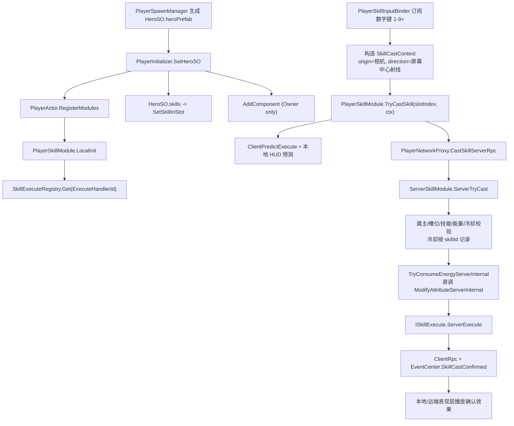

# Skill 系统接入主流程计划

> 状态：Accepted（2026-06-29 技术评审通过）  
> 日期：2026-06-29  
> 评审人：用户  
> 关联模块：SkillSystem、NetworkLayer、PlayerControl、HeroSO、GameHUD、InventorySystem、Attribute、DamageCenter、QualityEffects  
> 前置条件：HeroSO 已能携带主动技能定义；玩家 Prefab 已挂载 `PlayerActor`、`PlayerNetworkProxy`、`ServerSkillModule`、`ServerPlayerAttributeModule`；GameHUD 已存在能量与技能槽显示组件

## 背景

当前 Skill 系统已经不是空白模块，而是处于"管线骨架存在、主流程未接入完整玩法"的状态：

- `PlayerSkillModule` 已实现客户端释放入口、五维属性快照、能量软检查、本地预测、技能槽运行时和 RPC 请求。
- `ServerSkillModule` 已实现服务端查找 `SkillDefinitionSO`、五维最终值计算、能量校验、执行 `ISkillExecute.ServerExecute()` 和触发 `RaiseOnSkillCast()`。
- `PlayerNetworkProxy.CastSkillServerRpc()` 已能转发技能请求到 `ServerSkillModule`。
- `HeroSO.skills` 已能配置 `SkillAbilityDef`，其中包含 `SkillDefinitionSO`；执行器由 `SkillDefinitionSO.executeHandler` 枚举指向注册表。
- `PlayerInitializer` 已负责将 HeroSO 中的主动技能按列表顺序填入技能槽。
- `GameHUDWindow` 已初始化 `EnergyBarAndSkillsDataComponent`，该组件会读取 `PlayerSkillModule` 显示能量、技能图标和冷却。

主要缺口是：技能槽没有从 HeroSO 自动填入，输入没有正式绑定到技能释放，服务端冷却不是权威，能量扣除路径存在 RPC 语义风险，HUD 字段与 `SkillDefinitionSO` 数据结构不完全匹配，技能确认事件与远端表现同步仍未实现。

**代码探查确认（2026-06-29）：**
- `SkillDefinitionSO.icon` 继承自 `BaseSO`，已存在
- `SkillDefinitionSO.id` 继承自 `BaseSO`，已存在
- `SkillDefinitionSO.targetType` 支持 `None / Self / Direction / Point / Actor` 五种
- `PlayerSkillRuntime.ConsumeOneCharge()` 将 `currentCharges` 从 1 减到 0 后无恢复逻辑
- `ServerSkillModule.CheckAndConsumeCost` 不做服务端冷却追踪（注释标注为 TODO）
- `EnergyBarAndSkillsDataComponent.RefreshAllSkillSliders` 使用 `baseCooldown` 做分母，有冷却缩减时滑条不正确（Phase 3 修正）
- 属性同步链路：`NetworkVariable.Value` → Netcode 自动同步 → 客户端 `OnValueChanged` → `EventCenter.AttributeChanged` → UI 组件 — 正常运作

## 决策

Skill 系统接入采用"先闭环、再权威、再表现"的分阶段方案：

1. Phase 1 先把 HeroSO 技能槽、数字键输入、目标上下文构建接通，让玩家能在正式对局中释放技能。
2. Phase 2 收敛服务端权威：服务端独立维护冷却（按 skillId）、扣能量走 Server-only 内部方法、RPC 做属主与技能槽校验。
3. Phase 3 接入 HUD 与表现确认：客户端预测只负责本地即时反馈，服务端确认通过 `ClientRpc` 或 EventCenter 事件广播给表现层。
4. Phase 4 再补技能内容与主动道具体系，包括 `PiercingShot`、ActiveSkillItemSO 与技能槽替换。

不把敌人技能、复杂技能编辑器、技能树、多人分屏技能选择放进第一轮接入范围。

## 评审确认的关键决策

以下决策在 2026-06-29 技术评审中讨论并确认，与初稿存在差异的以本节为准：

### 输入与槽位

- **输入键位**：数字键 1-9+，`slotIndex = keyIndex - 1`。键位 0 对应 slot 9。英雄技能和道具技能统一通过动态槽位数组索引。
- **技能槽**：`_skills` 为动态列表，不区分英雄技能/道具技能来源。`TryCastSkill(int slotIndex, SkillCastContext)` 按索引释放。

### 技能目标类型

- **Self / Direction / Point 已覆盖所有需求**。`SkillTargetType.Actor` 枚举值保留但不实现，后续确实不需要则 deprecate。
- **Direction 技能**：视线扫射，在范围内的敌人列为作用对象。新增 `spreadAngle`（扩散角）和 `spreadRadius`（终点球体半径）字段到 `SkillDefinitionSO`。值为 0 时退化为单射线检测。
- **Point 技能**：射线命中点释放范围技能；无命中时用 `origin + direction * baseRange` 兜底。

### SkillCastContext 构建

- **origin**：相机位置（`Camera.main.transform.position`）
- **direction**：相机屏幕中心射线方向（`Camera.main.ViewportPointToRay(new Vector3(0.5f, 0.5f, 0))`）
- **point**：射线命中点或兜底值
- 此方案适用于所有射击验证，后续武器系统接入时统一照此标准。

### 冷却与能量

- **服务端冷却 key**：`Dictionary<string, float>` 按 `skillId` 记录 `nextAvailableServerTime`，不是 `slotIndex`。
- **能量扣除**：新增 `TryConsumeEnergyServerInternal(float amount)`，直接调用 `ModifyAttributeServerInternal` 绕过 RPC 层。
- **EnergyOnly 技能**：不消耗 charge，不触发冷却，由播放动画提供天然施法间隔。肉鸽鼓励玩家滥用构筑。
- **冷却恢复**：懒检测，`IsReady()` 时检查 `Time.time >= nextAvailableTime`，到期自动恢复 `currentCharges`。

### 组件挂载

- **PlayerSkillInputBinder**：运行时 `AddComponent`（由 `PlayerInitializer` 仅在 Owner 时挂载），避免改 Prefab。需配套配置手册。
- **PlayerInitializer**：Phase 1 保留在 `Assets/Scripts/Test/`，后续 Phase 4 统一迁移。

### 服务端确认与回滚

- **服务端成功确认**：Phase 1 最小实现（ClientRpc + EventCenter 事件 + Debug.Log），Phase 3 接入完整表现同步。
- **拒绝回滚**：Phase 2 再做（`SkillCastRejectedEvt` + 客户端冷却/能量回滚）。
- **动画接入**：Phase 3 处理（precast/cast/postcast 三阶段），标记为风险/TODO。

### 其他

- **SkillExecuteRegistry 重复 ID**：Phase 1 不做冲突处理，要求 `SkillExecuteHandlerId` 与注册表 key 一一对应。Phase 4 考虑 per-player Registry。
- **HUD 冷却滑条**：分母使用 `baseCooldown` 导致冷却缩减时滑条漂移，Phase 3 统一修正。
- **SkillDefinitionSO 字段去重**（2026-06-29 修复）：`id` 和 `description` 继承自 `BaseSO`，`SkillDefinitionSO` 原先重复声明导致 Unity 序列化报错 `The same field name is serialized multiple times`，已删除子类中的重复字段。

## 当前断点审计

| 断点 | 当前状态 | 处理建议 | 阶段 |
|------|----------|----------|------|
| 技能槽初始化 | `PlayerInitializer.ApplyHeroSkills()` 按 HeroSO.skills 顺序调用 `PlayerSkillModule.SetSkillInSlot()` | HeroSO 注入后按 `skills` 顺序填入技能槽，并校验 `ExecuteHandlerId` | Phase 1 |
| 输入绑定 | `PlayerInputSystem` 有 `OnCastSkillInput` / `OnCastUltimateInput`，但正式控制器未订阅 | 运行时 AddComponent `PlayerSkillInputBinder`，数字键 1-9+ → slotIndex | Phase 1 |
| 目标上下文 | `SkillCastContext` 支持 Point/Direction/Self，但正式运行时没有上下文构建器 | 相机中心射线构建 origin/direction/point | Phase 1 |
| 客户端冷却 | `PlayerSkillRuntime.ConsumeOneCharge()` 会把 `currentCharges` 减到 0，但没有恢复逻辑 | 冷却结束恢复 charge；EnergyOnly 不消耗 charge | Phase 1 |
| 服务端冷却 | `ServerSkillModule` 没有服务端冷却计时 | 增加 `Dictionary<string, float>`，按 skillId 记录 `nextAvailableServerTime` | Phase 1 |
| 能量扣除 | 服务端技能模块调用 `ConsumeEnergyServerRpc()`，内部再走 `ModifyAttributeServerRpc()` Owner 校验 | 新增 `TryConsumeEnergyServerInternal()`，直接调 `ModifyAttributeServerInternal` | Phase 1 |
| RPC 入口 | `PlayerNetworkProxy.CastSkillServerRpc()` 再调用带 `[ServerRpc]` 的 `ServerSkillModule.CastSkillServerRpc()` | 保留 Proxy 作为唯一网络入口，ServerSkillModule 暴露普通 server internal 方法 | Phase 2 |
| 服务端确认 | `SkillCastConfirmed` 仅 TODO，非释放者客户端没有确认表现通道 | Phase 1 最小实现（ClientRpc + EventCenter），Phase 3 完整表现 | Phase 1/3 |
| 拒绝回滚 | 无 | Phase 2 新增 `SkillCastRejectedEvt` + 客户端冷却/能量回滚 | Phase 2 |
| HUD 冷却滑条 | `RefreshAllSkillSliders` 用 `baseCooldown` 做分母，冷却缩减时滑条漂移 | 使用实际冷却时长替代 `baseCooldown` | Phase 3 |
| 动画接入 | `PlayerSkillModule.TriggerAnimation` 仍是 Debug.Log 占位 | Phase 3 接入 AnimationBridge / Animator trigger | Phase 3 |
| AoE 执行器 | `BombardAreaSkillExecutor` 中 `LayerMask.NameToLayer("Default")` 被当作 mask 使用，且半径可能重复乘 baseRange | Phase 2 前做技能执行器冒烟审计 | Phase 2 |
| 内容完整度 | `PiercingShotSkillExecutor` 仍是空壳 | 放入 Phase 4，不阻塞主流程闭环 | Phase 4 |
| 目录职责 | `PlayerInitializer` 位于 `Assets/Scripts/Test/`，但承担正式 HeroSO 注入职责 | Phase 1 保留原位，Phase 4 迁入正式目录 | Phase 4 |
| 扩散角字段 | `SkillDefinitionSO` 缺少 `spreadAngle` / `spreadRadius` | Phase 1 新增字段 | Phase 1 |

## 目标流程

## Phase 1：正式对局能释放技能

目标：玩家进入对局后，默认 HeroSO 的技能能通过数字键释放，并能在 HUD 上看到技能槽状态。

### 改动清单（按优先级排序）

**P0：阻塞性前置**

1. **`PlayerInitializer` 新增 `SetSkillInSlot` 调用**
   - 遍历 `heroSO.skills`，按索引调用 `PlayerSkillModule.SetSkillInSlot(index, skillDef.skillDefinition)`
   - 文件路径：`Assets/Scripts/Test/PlayerInitializer.cs`

2. **新建 `PlayerSkillInputBinder`**
   - 路径：`Assets/Scripts/PlayerControl/PlayerSkillInputBinder.cs`
   - 职责：只在 `IsOwner` 时启用；订阅数字键 1-9+ 输入；构建 `SkillCastContext`；调用 `PlayerSkillModule.TryCastSkill`
   - `OnDestroy` / `OnDisable` 中取消订阅
   - 输入事件：改用数字键 → slotIndex 直接映射（不再使用 `OnCastSkillInput`/`OnCastUltimateInput` 参数事件，如需扩展则以 slotIndex 为参数）

3. **`PlayerInitializer` 运行时挂载 `PlayerSkillInputBinder`**
   - 仅在 Owner 时 `gameObject.AddComponent<PlayerSkillInputBinder>()`

**P1：核心闭环**

4. **`PlayerSkillRuntime` 冷却恢复逻辑**
   - `CooldownOnly` / `CooldownAndEnergy`：冷却结束后恢复 `currentCharges`（懒检测，`IsReady()` 时判定）
   - `EnergyOnly`：不消耗 charge，不触发冷却

5. **`ServerSkillModule` 服务端冷却追踪**
   - 新增 `Dictionary<string, float> _nextAvailableServerTime`，key 为 `skillId`
   - `ServerTryCast` 校验阶段检查冷却

6. **`ServerPlayerAttributeModule.TryConsumeEnergyServerInternal`**
   - 纯服务端方法，绕过 RPC，直接调用 `ModifyAttributeServerInternal`

7. **`ServerSkillModule.CheckAndConsumeCost` 调用新接口 + 冷却校验**
   - 改用 `TryConsumeEnergyServerInternal` 替代 `ConsumeEnergyServerRpc`

8. **服务端成功确认（最小实现）**
   - `ClientRpc` 广播 `SkillCastConfirmedEvt`
   - Phase 1 远端表现最小实现（EventCenter 事件 + Debug.Log）

**P2：收尾**

9. **`SkillDefinitionSO` 扩散角字段**
   - 新增 `spreadAngle`（扩散角，0 = 单射线）和 `spreadRadius`（终点球体半径）

10. **Phase 1 配置手册**
    - 标注所有 Prefab/Inspector/SO 绑定需要人工确认
    - 记录 `PlayerSkillInputBinder` 的运行时挂载流程

### 验收标准

- Host 单人进入对局后，数字键 1 能释放 slot 0，数字键 2 能释放 slot 1。
- 冷却结束后同一技能可以再次释放。
- 能量不足时客户端拒绝释放或 HUD 置灰。
- `EnergyBarAndSkillsDataComponent` 能显示有技能的槽位，不出现空引用错误。

## Phase 2：服务端权威与安全校验

目标：客户端只能请求释放，技能是否成功由服务端最终裁定。

### 改动清单

- 将 `ServerSkillModule.CastSkillServerRpc()` 拆为：
  - 网络入口保留在 `PlayerNetworkProxy.CastSkillServerRpc()`
  - `ServerSkillModule` 提供普通方法 `ServerTryCastSkill(ClientSkillCastRequest request, ulong senderClientId)`
- 服务端校验必须包含：
  - `senderClientId == OwnerClientId`
  - `slotIndex` 合法
  - 请求的 `skillId` 与服务端记录的槽位技能一致
  - 技能目标类型与 `SkillDefinitionSO.targetType` 一致或可兼容
  - 能量足够
  - 当前服务器时间已过冷却（按 `skillId` 查询 `_nextAvailableServerTime`）
- 服务端维护冷却状态：
  - 以 `skillId` 为 key，记录 `nextAvailableServerTime`
  - 服务端确认释放成功后写入冷却
- 在 `ServerPlayerAttributeModule` 增加服务器内部能量操作接口：
  - `bool TryConsumeEnergyServerInternal(float amount)`
  - 不走 `[ServerRpc]`，直接调用 `ModifyAttributeServerInternal`
  - 只允许 `IsServer` 分支执行
- 新增拒绝回滚路径：
  - `SkillCastRejectedEvt` 事件结构体
  - 定向 `ClientRpc` 给属主，回滚 `currentCharges` 和 `nextAvailableTime`
- 审计 `BombardAreaSkillExecutor`：
  - `LayerMask.NameToLayer()` 需要转换成 `1 << layer`
  - `finalRange` 已经是最终范围时，不应再次乘 `baseRange`
  - `ctx.baseDamageProfile` / `ctx.bulletType` 的来源要明确

### 验收标准

- 非 Owner 客户端无法替别人释放技能。
- 客户端伪造 slot 或 skillId 被服务端拒绝。
- 远端客户端不能通过重复 RPC 绕过冷却。
- 技能成功释放会真实扣能量，并通过属性同步回到 HUD。
- 服务端拒绝时，客户端冷却/能量预测被回滚。

## Phase 3：HUD、事件与表现同步

目标：本地预测、服务端确认、远端表现三者职责清晰。

### 改动清单

- 技能动画接入：
  - `PlayerSkillModule.TriggerAnimation` 通过 `AnimationBridge` 设置 Animator trigger
  - precast → cast → postcast 三阶段精确同步
- `SkillDefinitionSO` 补充 UI 展示字段，或明确从 `SkillAbilityDef` 读取：
  - `icon`（已存在于 `BaseSO`）
  - 可选：`hudLabel` / `shortDescription`
- 新增事件结构体：
  - `SkillCastConfirmedEvt` 服务端确认用（Phase 1 最小实现基础上完善）
  - `SkillCastRejectedEvt` 回滚本地预测（Phase 2 实现）
- `ServerSkillModule` 成功释放后通过 ClientRpc 广播确认：
  - owner 客户端用于对齐冷却/能量/预测表现
  - 非 owner 客户端播放远端技能特效
- `EnergyBarAndSkillsDataComponent` 冷却滑条修正：
  - 使用实际冷却时长（`displayedCooldownDuration`）替代 `baseCooldown` 做分母
- `EnergyBarAndSkillsDataComponent` 支持服务端确认校正

### 验收标准

- 本地释放有即时反馈。
- 其他客户端能看到技能释放表现（包括动画和特效）。
- 服务端拒绝释放时，本地冷却预测能恢复或被校正。
- HUD 图标、冷却、能量状态不依赖不存在字段。
- 冷却滑条在冷却缩减影响下仍然准确。

## Phase 4：内容补全与主动道具联动

目标：让 Skill 从"英雄自带技能"扩展到可成长、可替换、可道具化。

### 改动清单

- 完成 `PiercingShotSkillExecutor`：
  - `SkillTargetType.Direction` 路线
  - 服务端查找目标并走 `DamageCalculator.CalculateDamageFromProfile`
  - 溅射范围与上限公式写入技能文档
- 扩展 `ActiveSkillItemSO`：
  - 增加 `SkillDefinitionSO skillDefinition`
  - 可选：覆盖图标、消耗、冷却或附加标签
- Inventory 主动槽变化时，更新 `PlayerSkillModule` 的对应技能槽。
- 所有主动能力（英雄技能 + 道具技能）统一进入 `_skills` 动态槽位数组，通过数字键释放。
- `PlayerInitializer` 从 `Assets/Scripts/Test/` 迁移到正式玩家初始化目录。
- `SkillExecuteRegistry` 考虑引入 per-player Registry，避免全局覆盖。
- 品质效果的 `OnSkillCast` / `OnSkillHit` 能稳定触发。

### 验收标准

- 至少两个技能执行器有实际服务端效果。
- 主动技能道具能进入一个明确槽位并释放。
- 品质效果的 `OnSkillCast` / `OnSkillHit` 能稳定触发。

## Phase 5：文档与验证

每个代码阶段完成后必须同步更新相关模块文档：

- 修改 Skill 逻辑：更新 `Assets/Framework/LogicLayer/SkillSystem/MODULE.md`
- 修改输入绑定：更新 `Assets/Scripts/PlayerControl/MODULE.md`
- 修改 RPC / ServerAuthority：更新 `Assets/Framework/NetworkLayer/MODULE.md`
- 修改 HUD：更新 `Assets/Scripts/UI/DataComponent/MODULE.md`
- 修改 Inventory 主动技能道具：更新 `Assets/Scripts/InventorySystem/MODULE.md`

验证建议：

- 若 UnityMCP 可用，代码修改后通过 MCP 检查 Console 编译错误。
- 不默认修改 `.unity`、`.prefab`、`.asset` 文件。
- Prefab、Inspector、SO 绑定由 Unity Editor 人工确认。

## 需要人工确认

| 项目 | 原因 | 状态 |
|------|------|------|
| `HeroSO.skills` 的槽位数量 | 英雄技能 + 道具技能统一进入 `_skills` 动态数组；数字键 1-9+ 直接映射索引 | ✅ 已确认 |
| `PlayerInitializer` 目录归属 | Phase 1 保留在 `Assets/Scripts/Test/`，Phase 4 迁入正式目录 | ✅ 已确认 |
| `PlayerSkillInputBinder` 挂载方式 | 运行时 AddComponent（方案 B），避免改 Prefab；需配置手册 | ✅ 已确认 |
| 技能图标来源 | `SkillDefinitionSO.icon` 继承自 `BaseSO`，已存在 | ✅ 已确认（代码探查验证） |
| 技能目标 LayerMask | AoE 应命中敌人、任务目标还是所有可攻击对象，需要确认 Layer 与 Collider 规范 | ⚠️ 待确认 |
| 玩家 Prefab Inspector 绑定 | `PlayerNetworkProxy.ServerSkillModule`、`ServerPlayerAttributeModule` 等字段必须已绑定 | ⚠️ 待确认 |
| SkillDefinitionSO.executeHandler | 必须选择能在 `SkillExecuteRegistry` 中找到对应 `ISkillExecute` 的枚举值 | ⚠️ 待确认 |
| 技能伤害来源 | 需要确认技能按武器面板、SkillDefinitionSO 独立面板，还是两者组合 | ⚠️ 待确认 |
| 技能目标类型 `Actor` | 评审确认 Self/Direction/Point 已覆盖所有需求；`Actor` 保留但不实现，后续可能 deprecate | ✅ 已确认 |
| 所有射击验证的 origin 来源 | 统一使用相机位置 + 屏幕中心射线 | ✅ 已确认 |

## 风险与约束

- 当前技能模块涉及 `SerializeField`、HeroSO、玩家 Prefab、HUD 绑定，无法仅通过 `.cs` 文件完全确认实际运行状态。
- 服务端冷却与客户端预测需要有校正路径，否则多人场景中容易出现 HUD 显示可用但服务端拒绝的体验。
- `SkillExecuteRegistry` 使用静态内置注册；Phase 1 不做冲突处理，要求 `SkillExecuteHandlerId` 与注册表 key 一一对应。Phase 4 考虑 per-player Registry。
- `AttributeChanged` 事件链路已验证：`NetworkVariable.OnValueChanged`（客户端）→ `EventCenter.AttributeChanged` → UI 组件。链路正常运作，无风险。
- 技能执行器中直接使用 Physics 查询时，必须避免命中自己、友军或非战斗碰撞体。
- 任何新增 `ServerRpc` 都必须校验 `OwnerClientId` 或校验请求者与目标/位置的合法关系。
- Phase 1 动画为 Debug.Log 占位，进入对局时远端玩家看不到施法表现，但不影响功能验证。Phase 3 接入完整动画同步。
- `PlayerSkillInputBinder` 方案 B（运行时 AddComponent）需要在配置手册中明确标注所有运行时引用链。

## 当前建议结论

先做 Phase 1 + Phase 2 的最小闭环：HeroSO 技能入槽、数字键输入绑定（1-9+）、服务端冷却与能量权威。这样 Skill 系统能从"测试脚本可用"进入"正式对局可用"。表现同步、主动道具、第二个技能执行器可以在主闭环稳定后再分阶段补齐。

Phase 1 实施完成后，立即编写配置手册，覆盖 `PlayerSkillInputBinder` 的运行时挂载流程和所有 Inspector/SO 绑定项。
