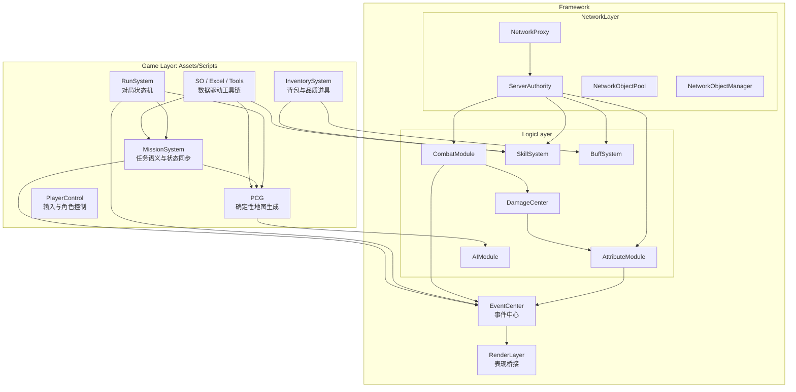

# Matrix 系统总体架构

本文说明 Matrix 技术展示版中的系统架构。该仓库不是完整 Unity 工程，文档重点放在模块分层、数据流和核心设计思路。

## 1. 架构目标

Matrix 的架构围绕多人 Roguelike TPS 技术原型展开，主要目标是：

- 在多人场景下保持服务器权威，减少客户端作弊空间。
- 让地图生成、任务系统、战斗系统、AI 和 UI 通过清晰边界协作。
- 用数据驱动方式组织英雄、技能、任务、地图风格和道具效果。
- 将 Unity 表现层、网络同步层和纯逻辑层尽量分离。

## 2. 分层结构

```text
Game Layer: Assets/Scripts/
  RunSystem
  MissionSystem
  PCG
  InventorySystem
  ArchiveSystem
  PlayerControl
  SO / Excel / Tools

Framework Layer: Assets/Framework/
  EventCenter
  LogicLayer
  NetworkLayer
  RenderLayer
  UI
  Resource / Pool / Singleton / Json
```

| 层级 | 职责 |
|---|---|
| Game Layer | 对局流程、任务、地图生成、背包、存档、玩家输入等具体游戏系统 |
| LogicLayer | Actor、Attribute、Combat、Skill、Buff、Damage、AI 等核心逻辑 |
| NetworkLayer | Netcode for GameObjects 的代理、同步、对象池和服务器权威模块 |
| RenderLayer | DamageText、RenderActor 等表现层桥接 |
| Infrastructure | EventCenter、UI 框架、资源加载、对象池、单例、Json 工具 |

## 3. 总体关系图



## 4. 服务器权威网络架构

项目使用 Netcode for GameObjects。核心思想是：客户端提交意图，服务端验证和结算，结果通过网络变量、网络列表、ClientRpc 或事件广播同步给客户端。

典型链路：

```text
Client Input
  -> PlayerNetworkProxy.ServerRpc
  -> ServerAuthority Module
  -> LogicLayer 结算
  -> NetworkVariable / NetworkList / ClientRpc
  -> EventCenter
  -> UI / RenderLayer
```

关键文件：

- `src/Assets/Framework/NetworkLayer/Proxy/NetworkProxyBase.cs`
- `src/Assets/Framework/NetworkLayer/Proxy/PlayerProxy/PlayerNetworkProxy.cs`
- `src/Assets/Framework/NetworkLayer/NetworkObjectManager/NetworkObjectManager.cs`
- `src/Assets/Framework/NetworkLayer/NetworkObjectPool/`
- `src/Assets/Framework/NetworkLayer/ServerAuthority/`

## 5. PCG 与任务系统关系

MissionSystem 先生成任务语义输入，PCG 再根据输入决定哪些房间承担 Boss、歼灭、防守、捕获、破坏等任务角色。

```text
MissionLibrary / MissionConfig
  -> MissionGroupRuntimeData
  -> MapTaskInput
  -> PcgGeneratePackage
  -> RoomGraphBuilder
  -> RoomRoleAllocator
  -> RoomStitcher
  -> PcgMapGenerationResult
  -> MissionManager 绑定任务房间
```

这一设计让任务系统不直接控制具体地图布局，而是通过语义输入影响 PCG 的角色分配。

## 6. 战斗数值管线

战斗管线拆成几个阶段：

```text
Fire Request
  -> ServerCombatModule 验证
  -> HitScan / Projectile 解析命中
  -> DamageInfo
  -> DamageCalculator
  -> ServerAttributeModule 扣血 / 扣盾
  -> Buff / QualityEffects 回调
  -> EventCenter 广播 UnitDamaged / UnitDied
  -> DamageText / UI / MissionSystem 响应
```

这种拆分便于替换武器开火方式、调整伤害公式、扩展 Buff 或品质道具效果。

## 7. AI 架构

AI 模块包含状态机、感知、移动、调度、兴趣区域和群体行为：

- `AIStateMachine` 管理 Idle、Patrol、Chase、Attack。
- `PerceptionSystem` 从 `AttackableObjectManager` 中选择目标。
- `AIScheduler` 按距离、战斗状态和兴趣区域调整 Tick 频率。
- `InterestRegionManager` 用于热点唤醒。
- `Boids` 和 `SteeringSystem` 处理群体移动和避障。
- Navigation 子模块适配 PCG 生成地图的拓扑和 NavMeshLink。

## 8. 数据驱动

项目使用 ScriptableObject 管理配置：

- `HeroSO`：英雄属性、主动技能、被动能力和 Prefab 引用。
- `SkillDefinitionSO`：技能消耗、目标、执行器 ID 和数值配置。
- `MissionConfig`：任务类型、奖励、触发方式和生成配置。
- `PcgGenerationProfile`：地图风格、房间池、生成参数和敌人池。
- `QualityItemSO`：品质道具效果配置。

Showcase 仓库只保留代码定义，不包含真实 `.asset` 配置资源。

## 9. 架构边界

本仓库只展示源码和文档，不能完全表达 Unity Inspector 中的绑定关系。以下内容需要在完整工程中确认：

- Prefab 上挂载了哪些组件。
- `[SerializeField]` 字段是否正确赋值。
- Scene 中有哪些管理器对象。
- ScriptableObject 资源之间的引用关系。
- 第三方插件运行时行为。

因此，Showcase 更适合架构评审和代码阅读，不适合作为完整运行环境。
