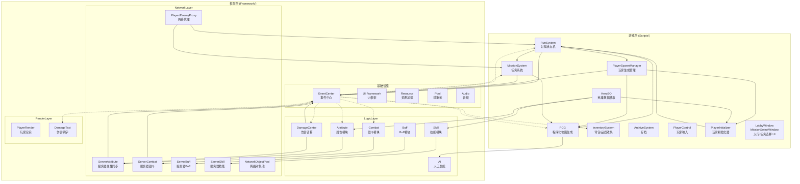
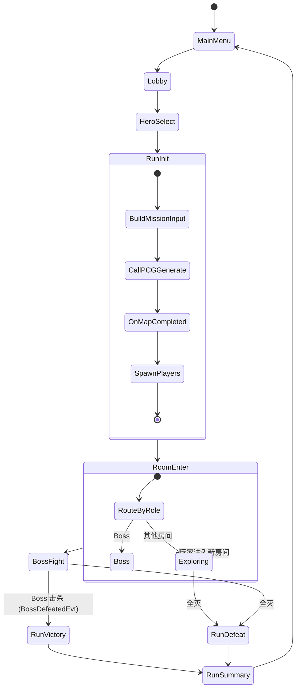
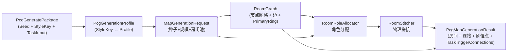
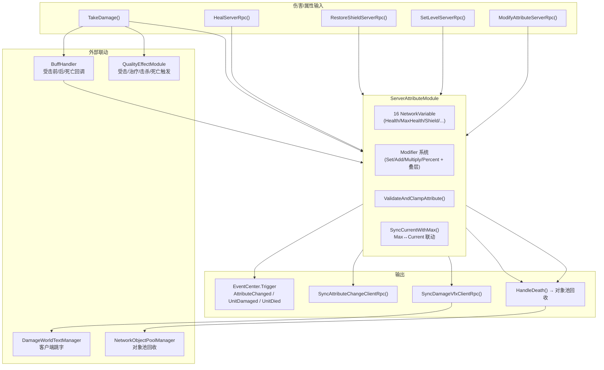

# ARCHITECTURE.md — Matrix 项目架构说明

> 文档版本：v0.5 | 更新日期：2026-05-17  
> 全 16 篇核心模块文档已完成，新增 HeroSO 体系，覆盖从 EventCenter → PlayerControl 的完整模块地图

---

## 1. 总体架构图



**图例**：
- 实线箭头 `→`：直接引用/调用
- 虚线箭头 `-.->`：通过 EventCenter 间接通信

## 2. 架构分层说明

| 层 | 职责 | 关键约束 |
|----|------|---------|
| **基础设施** | 事件/UI/资源/对象池/音频 | 不持有游戏逻辑引用 |
| **逻辑层** | Module 组合 + Actor + Buff/Skill/Damage | 不依赖 Unity 特定类型（MonoBehaviour 除外） |
| **网络层** | Netcode 同步 | 继承 NetworkBehaviour；ServerRpc 校验属主 |
| **渲染层** | 表现层（RenderActor + DamageText） | 仅订阅 EventCenter，不直接操作逻辑层 |
| **游戏层** | Run/PCG/Mission/Inventory 等 | 可引用 Framework 任意层 |

**核心原则**：逻辑层和网络层是"服务器权威"的镜像关系。`ServerAttributeModule` 在服务端维护完整的 `AttributeData`（含 Modifiers），客户端仅通过 `NetworkVariable` 读取同步值。

## 3. RunSystem 在整体流程中的位置



**RunManager 在流程中的角色**：
- 调用 `MissionManager.TryBuildCurrentPcgTaskInput()` 获取任务输入
- 调用 `PcgMapGenerator.Generate()` 生成地图
- 接收 `OnGenerationCompleted` 后初始化 `MonsterSpawnManager` 和 `PlayerSpawnManager`
- `PlayerSpawnManager.OnMapReady()` 为所有已连接客户端生成玩家（`SpawnAsPlayerObject`）
- 每个状态进入时触发对应的 EventCenter 事件
- **不直接**操作玩家生成（由 `PlayerSpawnManager` 管理）、怪物生成（由 `MonsterSpawnManager` 自主管理）、战斗结算、奖励发放（由 `ServerEnemyAttributeModule.HandleDeath()` 查表掉落）

## 4. EventCenter 在模块通信中的位置

```
模块 A（如 ServerAttributeModule）
    │
    ├─ EventCenter.Instance.AddListener<UnitDiedEvt>(EventName.UnitDied, handler)
    │
    └─ EventCenter.Instance.Trigger<AttributeType, float, float>(
           EventName.AttributeChanged, type, oldValue, newValue)
                │
                ▼
       ┌────────────────────────────────────┐
       │          EventCenter               │
       │  按优先级降序分发到匹配的监听者      │
       └────────────────────────────────────┘
                │
        ┌───────┼───────┬───────────┐
        ▼       ▼       ▼           ▼
    模块 B   模块 C   模块 D      模块 E
  (UI刷新) (跳字)  (AI反应)   (属性面板)
```

**28 个事件类型**，分三类：

| 类别 | 事件 | 触发方 |
|------|------|--------|
| 战斗 | WeaponEquipped/Fired, ProjectileSpawned, HitResolved, Reload*, UnitDamaged, UnitDied, AttributeChanged | ServerAttributeModule / ServerCombatModule |
| 物品 | ItemPickedUp/Used/Removed, WeaponAttributeModified, PlayerEnergyExhaust | InventorySystem / QualityEffects |
| 对局 | RunStateChanged, RunSeedFinalized, RoomEntered/CombatStarted/Cleared, PathChoice*, BossFightStarted/Defeated, RunVictory/Defeat, RunSummaryReady, AllPlayersDead | RunManager |

**关键规则**：
- 同一 `EventName` 可绑定多个泛型签名，监听者需匹配
- `AttributeChanged` 当前统一使用裸参数形式 `Trigger<AttributeType, float, float>`
- `RunSeedFinalized` 使用裸 `int` 参数
- 其余事件使用专用 struct

## 5. PCG 与 RoomRoleAllocator 的关系



**RoomRoleAllocator 的定位**：
- **输入**：无角色标注的 `RoomGraph` + 任务语义 `MapTaskInput`
- **输出**：每个节点被赋予 `AssignedRole` + `HasAssignedSideTask` + `TaskTriggerConnection` 列表
- **算法策略**：PrimaryRing ≥ 4 → RingTopology；否则 → LinearFallback
- **确定性**：使用 `DeterministicRandom(ref)` 保证相同 Seed 相同结果
- **不被** MissionManager 直接调用；MissionManager 在 PCG 完成后反查结果

## 6. ServerAttributeModule 与各系统的关系



**伤害处理完整管线**（`TakeDamage()`）：
```
BuffHandler.ApplyUponBeHurt → DamageCalculator.ApplyDamage 
→ 扣盾/扣血 → BuffHandler.ApplyOnBeHurt 
→ QualityEffect.RaiseOnHitReceived → 元素触发 
→ EventCenter.Trigger(UnitDamaged) → SyncDamageVfxClientRpc 
→ CheckDeathCondition → (if Health≤0) HandleDeath 
  → EventCenter.Trigger(UnitDied) → QualityEffect.RaiseOnDeath 
  → 1秒延迟 → NetworkObjectPoolManager.DespawnAndRecycle
```

## 7. 对局生命周期流程

```
                         ┌──────────────────────────────┐
                         │        RunManager            │
                         │    (NetworkBehaviour)        │
                         │   服务器权威状态机            │
                         └──────────────────────────────┘
                              │          │
                    ┌─────────┘          └─────────┐
                    ▼                              ▼
           ┌──────────────┐              ┌──────────────┐
           │  PcgMapGen   │              │ MissionMgr   │
           │  地图生成     │              │  任务管理     │
           └──────────────┘              └──────────────┘
                    │                              │
                    ▼                              ▼
           ┌──────────────┐              ┌──────────────┐
           │RoomRoleAlloc │              │ MissionBase  │
           │  角色分配     │              │  任务实例     │
           └──────────────┘              │ (BossMission  │
                    │                    │  触发 Boss    │
                    ▼                    │  DefeatedEvt) │
           ┌──────────────┐              └──────────────┘
           │ PlayerSpawn  │                      │
           │   Manager    │                      ▼
           │ (PCG完成→    │              ┌──────────────┐
           │  批量生成玩家)│              │EnemySpawn    │
           │  支持中途加入 │              │  Service     │
           └──────────────┘              │  刷怪工厂     │
                    │                    └──────────────┘
                    ▼                           │
           ┌──────────────┐                     ▼
           │MonsterSpawn  │              ┌──────────────┐
           │   Manager    │              │ NetworkObject│
           │ (自主刷怪     │              │ PoolManager  │
           │  难度等级     │              │  对象池生成   │
           │  接入)        │              └──────────────┘
           └──────────────┘
```

## 8. 地图生成流程

```
PcgMapGenerator.Generate(package)
    │
    ├─ 1. Resolve Profile
    │     profileRegistry.TryGetProfile(StyleKey) → PcgGenerationProfile
    │
    ├─ 2. Build & Normalize Request
    │     MapGenerationRequest (Seed + RoomPool + Scale + Resources)
    │
    ├─ 3. RoomGraphBuilder.Build()
    │     输入: request + DeterministicRandom
    │     输出: RoomGraph (节点网格 + 边 + PrimaryRing)
    │
    ├─ 4. RoomRoleAllocator.AssignRoles()
    │     输入: graph + taskInput + DeterministicRandom
    │     输出: graph.AssignedRole + TaskTriggerConnections
    │
    └─ 5. [Loop: maxStitchAttempts]
         ├─ Instantiate Rooms (SelectRoomPrefab → Instantiate)
         ├─ RoomStitcher.Stitch() (BFS 从 Start → 对齐连接器)
         ├─ CollectSpawnPoints (扫描 Marker 组件)
         └─ SpawnResources (按权重随机生成资源)
              │
              └─ OnGenerationCompleted(PcgMapGenerationResult)
```

## 9. 属性/伤害处理流程

```
属性变更（装备/Buff）:
  ModifyAttributeServerRpc(type, value, modifyType, sourceId, stacks)
    → [Owner校验] → ModifyAttributeServerInternal()
      → 查找/新建/叠层 AttributeModifier
      → MarkCacheDirty → re-evaluate finalValue
      → 联动 MaxHealth/MaxShield/MaxEnergy → SyncCurrentWithMax
      → UpdateNetworkVariable → SyncAttributeChangeClientRpc
      → EventCenter.Trigger(AttributeChanged, type, old, new)

伤害处理:
  TakeDamage(DamageInfo)
    → BuffHandler.ApplyUponBeHurt (减伤/无敌帧)
    → DamageCalculator.ApplyDamage (元素克制/破盾)
    → 扣盾 + 扣血
    → BuffHandler.ApplyOnBeHurt (受击后回调)
    → QualityEffect.RaiseOnHitReceived
    → 元素触发层数
    → EventCenter.Trigger(UnitDamaged)
    → SyncDamageVfxClientRpc → DamageWorldTextManager
    → CheckDeathCondition → HandleDeath (if Health≤0)
      → EventCenter.Trigger(UnitDied)
      → 1秒延迟 → NetworkObjectPoolManager.DespawnAndRecycle
```

## 10. 当前模块依赖关系

| 依赖方 | 被依赖方 | 方式 |
|--------|---------|------|
| RunManager | EventCenter | 广播 Run 生命周期事件；监听 BossDefeatedEvt |
| RunManager | PcgMapGenerator | 直接调用 Generate() |
| RunManager | MissionManager | 直接调用 TryBuildCurrentPcgTaskInput() |
| RunManager | MonsterSpawnManager | 直接调用 InitializeWithMapResult() |
| MissionManager | EventCenter | 订阅 UnitDied |
| MissionManager | PcgMapGenerator | 读取 LastResult |
| MissionManager | EnemySpawnService | 直接调用 SpawnEnemy() |
| BossMission | EventCenter | Complete() 时触发 BossDefeatedEvt |
| PcgMapGenerator | RoomGraphBuilder | 直接调用 Build() |
| PcgMapGenerator | RoomRoleAllocator | 直接调用 AssignRoles() |
| PcgMapGenerator | RoomStitcher | 直接调用 Stitch() |
| PcgMapGenerator | DeterministicRandom | 值类型传递 |
| ServerAttributeModule | EventCenter | 广播 AttributeChanged / UnitDamaged / UnitDied |
| ServerAttributeModule | BuffHandler | 直接调用 ApplyUponBeHurt / ApplyOnBeHurt |
| ServerAttributeModule | NetworkObjectPoolManager | 死亡后 DespawnAndRecycle |
| ServerEnemyAttributeModule | EnemyDropTableSO | HandleDeath → TrySpawnDropsOnServer 查表掉落 |
| RunManager | PlayerSpawnManager | 直接调用 OnMapReady() |
| PlayerSpawnManager | PcgMapGenerationResult | 读取 Start 房间信息解析出生点 |
| PlayerSpawnManager | NetworkManager | 监听 OnClientConnected/Disconnected；调用 SpawnAsPlayerObject |
| MonsterSpawnManager | EventCenter | 订阅 UnitDied（统计击杀数） |
| MonsterSpawnManager | EnemySpawnService | 直接调用 SpawnEnemy() |
| MonsterSpawnManager | ServerEnemyAttributeModule | SpawnMonsterAt 后调用 SetLevelServerRpc |
| MissionSelectWindow | PcgGenerationProfileRegistry | 读取 Style 列表供玩家选择 |
| MissionSelectWindow | PcgGenerationProfile | 读取 AvailableEnemies 展示敌人预览 |
| LobbyWindow | RunManager | 房主点击开始战斗 → TransitionTo(RunInit) |
| PlayerSpawnManager | PlayerInitializer | 生成后调用 SetHeroSO() 注入英雄数据 |
| PlayerInitializer | HeroSO | 注入英雄数据并按 `HeroSO.skills` 填充主动技能槽 |
| PlayerInitializer | SkillExecuteRegistry | 校验 `SkillDefinitionSO.ExecuteHandlerId` 是否存在对应执行器 |
| PlayerActor | HeroSO | RegisterModules() 读取 HeroSO.attributeConfig；RegisterPassives() 调用 IPassiveExecutor |
| PlayerActor | PassiveExecutorSO / IPassiveExecutor | OnHeroSpawned(this) / OnHeroDestroyed(this) 生命周期回调 |
| HeroSO | PlayerAttributeConfig | 引用 attributeConfig，注入到 PlayerAttributeModule |
| HeroSO | SkillDefinitionSO | 通过 SkillAbilityDef 引用技能定义 |
| DefaultPlayerSelector | SOManager | GetSOList<HeroSO>() 获取英雄列表 |
| DefaultPlayerSelector | HeroSO | 构建 PlayerSelectionInfo（含 HeroSO 引用） |

## 11. 全部模块文档完成状态（共 16 篇）

| 模块 | 路径 | 文档 |
|------|------|------|
| EventCenter | `Framework/EventCenter/` | MODULE.md |
| RunSystem | `Scripts/RunSystem/` | MODULE.md |
| PCG | `Scripts/PCG/` | MODULE.md + RoomRoleAllocator功能解读 |
| MissionSystem | `Scripts/MissionSystem/` | MODULE.md |
| AI | `Framework/LogicLayer/Module/AIModule/` | MODULE.md |
| Combat | `Framework/LogicLayer/Module/CombatModule/` | MODULE.md |
| Skill | `Framework/LogicLayer/SkillSystem/` | MODULE.md |
| InventorySystem + QualityEffects | `Scripts/InventorySystem/` | MODULE.md |
| ArchiveSystem | `Scripts/ArchiveSystem/` | MODULE.md |
| Attribute | `Framework/LogicLayer/Module/AttributeModule/` | MODULE.md |
| UI Framework | `Framework/UI/` | MODULE.md |
| NetworkLayer | `Framework/NetworkLayer/` | MODULE.md |
| BuffSystem | `Framework/LogicLayer/BuffSystem/` | MODULE.md |
| DamageCenter | `Framework/LogicLayer/DamageCenter/` | MODULE.md |
| ServerAttributeModule | `NetworkLayer/ServerAuthority/AttributeSystem/` | 功能解读 |
| PlayerControl | `Scripts/PlayerControl/` | MODULE.md |
| PlayerSpawnManager | `Scripts/SpawnSystem/PlayerSpawnManager.cs` | CodingPlan/ |
| LobbyWindow | `Scripts/UI/WindowComponent/LobbyWindow.cs` | CodingPlan/ |
| MissionSelectWindow | `Scripts/UI/WindowComponent/MissionSelectWindow.cs` | CodingPlan/ |

**轻量模块**（不单独建 MODULE.md）：SpawnSystem（含 PlayerSpawnManager）、SO 定义、Excel 导入、Managers/Tools/Enum

---

> **v0.4 更新**：新增 PlayerSpawnManager（玩家生成管理）、LobbyWindow/MissionSelectWindow（UI 窗口）、PcgGenerationProfile Enemy Pool（Style↔敌人映射）架构文档。Mermaid 架构图覆盖全部已知依赖关系。
>
> **v0.5 更新**：新增 HeroSO 英雄数据模板体系（HeroSO + SkillAbilityDef + PassiveAbilityDef + IPassiveExecutor）。PlayerActor/PlayerInitializer/PlayerSpawnManager/DefaultPlayerSelector 全部接入 HeroSO 数据驱动流程。标准 PlayerPrefab（空壳）+ HeroSO 注入 → 属性初始化 + 主动技能入槽 + 被动生命周期注册。架构图新增 HeroSO/PlayerInitializer 节点及 6 条新连线。
