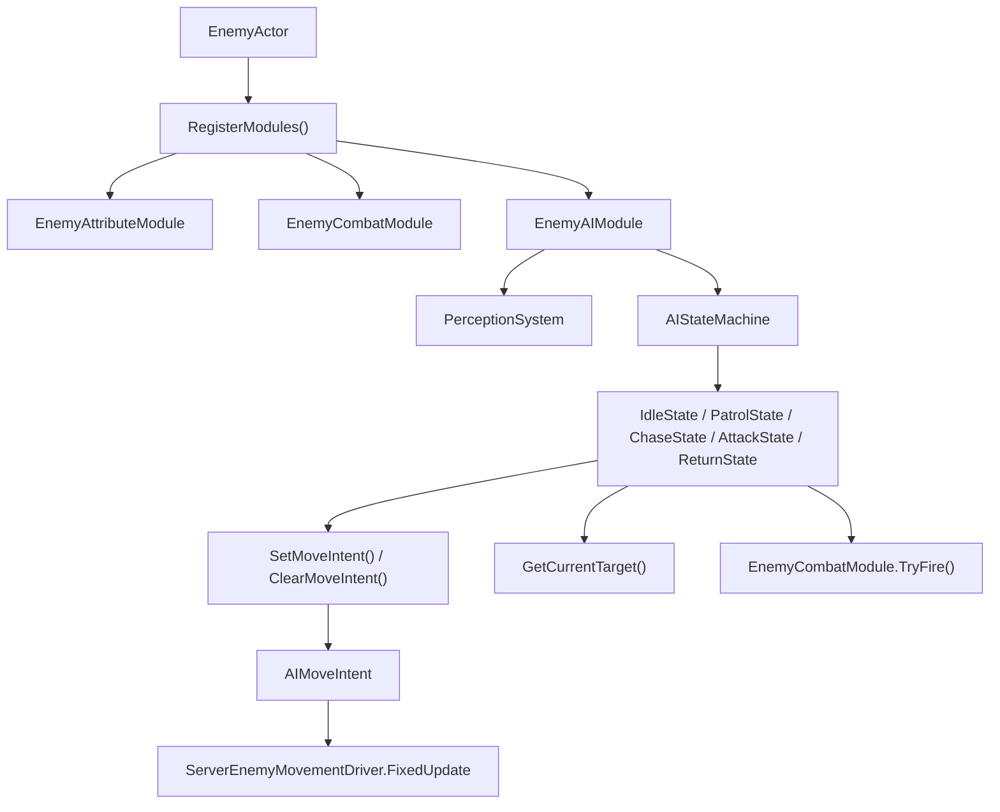
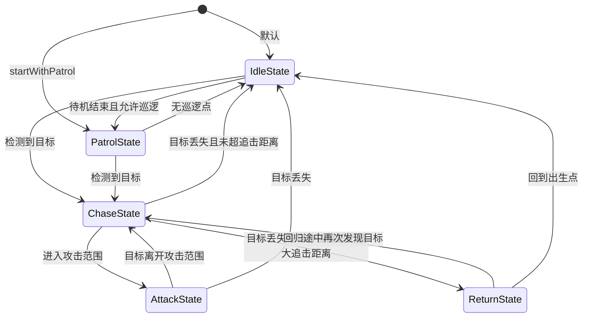

# Enemy AI 模块介绍

本文档基于当前目录下的实际代码实现整理，目标是帮助你快速理解敌人 AI 的模块边界、初始化流程、每帧运行逻辑，以及各个状态之间如何切换。

## 1. 模块定位

当前敌人 AI 的核心职责是：

1. 感知玩家目标。
2. 根据当前状态决定敌人的行为。
3. 输出移动意图给移动驱动。
4. 在可攻击时调用战斗模块发起攻击。

AI 本身并不直接承担完整的位移和伤害结算，而是作为“决策层”存在：

- `EnemyAIModule` 负责总控。
- `PerceptionSystem` 负责选目标。
- `AIStateMachine` 负责状态切换。
- 各个 `State` 负责具体行为。
- `ServerEnemyMovementDriver` 负责真正执行位移。
- `EnemyCombatModule` 负责真正执行攻击。

换句话说，这套 AI 更像是一个“输出意图”的行为系统，而不是一个把所有逻辑都包在一起的单体控制器。

## 2. 主要文件与职责

### 2.1 总控层

- `EnemyAIModule.cs`
  - AI 模块入口。
  - 持有状态机、感知系统、当前目标、初始出生点。
  - 对外暴露 `MoveIntent`，供移动驱动读取。
  - 每次 Tick 时先更新感知，再驱动状态机执行当前状态。

- `AIStateMachine.cs`
  - 管理 `_currentState` 和 `_previousState`。
  - 切换状态时会先退出旧状态，再进入新状态。
  - 保留最近 10 条状态历史，主要用于调试。

### 2.2 配置层

- `Config/EnemyAIConfig.cs`
  - 所有 AI 参数都收敛在这里。
  - 包括待机、巡逻、感知、追击、攻击等参数。
  - 是一个 `ScriptableObject`，由 `EnemyActor` 从 `Resources` 加载。

### 2.3 感知层

- `Perception/PerceptionSystem.cs`
  - 当前实现通过 `Object.FindObjectsOfType<PlayerActor>()` 枚举场景中的所有玩家。
  - 按距离、视野角、视线遮挡等条件筛选。
  - 返回最近的有效目标。

### 2.4 状态层

- `States/AIStateBase.cs`
  - 所有状态的基类。
  - 持有 `EnemyActor`、`EnemyAIModule`、`EnemyAIConfig`、`AIStateMachine` 引用。

- `States/IdleState.cs`
  - 待机。
  - 随机等待一段时间后，如果允许巡逻，则切到巡逻。
  - 期间只要检测到目标，就立刻切到追击。

- `States/PatrolState.cs`
  - 巡逻。
  - 当前实现会围绕出生点生成 4 个简单巡逻点。
  - 持续输出移动意图，走到一个点后切换到下一个点。
  - 若发现目标则切到追击。

- `States/ChaseState.cs`
  - 追击。
  - 持续朝目标输出移动意图。
  - 如果进入攻击距离，切到攻击。
  - 如果目标丢失，则根据敌人与出生点距离决定回待机还是回归。

- `States/AttackState.cs`
  - 攻击。
  - 保持朝向目标。
  - 满足冷却条件时调用战斗模块的 `TryFire`。
  - 目标离开攻击范围时重新切回追击。

- `States/ReturnState.cs`
  - 回归。
  - 目标丢失且敌人跑太远时，返回初始出生点。
  - 回程中如果重新发现目标，则再次切回追击。

### 2.5 移动与战斗协作层

- `Movement/AIMoveIntent.cs`
  - AI 输出给移动系统的轻量结构体。
  - 只包含 `hasIntent`、`direction`、`speed`。

- `ServerEnemyMovementDriver.cs`
  - 在 `FixedUpdate` 中读取 `EnemyAIModule.MoveIntent`。
  - 按方向和速度直接修改 `transform.position`。
  - 同时做一个平滑转向。

- `EnemyCombatModule.cs`
  - `AttackState` 不直接造成伤害，而是构造 `FireContext` 后调用这里的 `TryFire`。
  - 真正的武器发射、命中预测和特效事件都在战斗模块里完成。

## 3. 总体架构关系



可以把它理解成三层：

1. `EnemyActor` 负责装配模块。
2. `EnemyAIModule + StateMachine + State` 负责做决策。
3. `MovementDriver` 和 `CombatModule` 负责执行决策。

## 4. 初始化流程

### 4.1 从 `EnemyActor` 开始

`EnemyActor` 继承自 `LogicActor`，而 `LogicActor.LocalInit()` 会：

1. 调用 `RegisterModules()`。
2. 把各个模块加入 `Modules` 列表。
3. 依次调用每个模块的 `LocalInit()`。

在 `EnemyActor.RegisterModules()` 中，初始化顺序是：

1. 创建 `EnemyAttributeModule`。
2. 创建 `EnemyCombatModule`。
3. 加载 `EnemyAIConfig`。
4. 创建 `EnemyAIModule`。

因此，AI 模块在自身 `LocalInit()` 时，可以安全获取：

- `EnemyAttributeModule`
- `EnemyCombatModule`

这也是为什么状态里可以直接通过 `_aiModule.GetAttributeModule()` 和 `_aiModule.GetCombatModule()` 拿到依赖。

### 4.2 `EnemyAIModule.LocalInit()` 做了什么

`EnemyAIModule.LocalInit()` 的工作顺序是：

1. 读取属性模块和战斗模块引用。
2. 记录敌人初始化时的世界坐标 `_initialPosition`。
3. 创建 `PerceptionSystem`。
4. 创建 `AIStateMachine`。
5. 根据配置决定初始状态：
   - `startWithPatrol == true` 时进入 `PatrolState`
   - 否则进入 `IdleState`
6. 订阅 `MonoManager.Instance.OnUpdate += ServerTick`。

这里的 `_initialPosition` 很重要，后续：

- `PatrolState` 会以它为中心生成巡逻点。
- `ChaseState` 会用它判断是否追太远。
- `ReturnState` 会把它作为回归终点。

## 5. 运行时主循环

### 5.1 AI Tick 的入口

当前代码里，AI 有两个可能的驱动入口：

#### 入口 A：`EnemyAIModule.LocalInit()`

AI 模块会订阅：

`MonoManager.Instance.OnUpdate += ServerTick`

这意味着它会跟随全局 Update 驱动执行。

#### 入口 B：`EnemyNetworkProxy`

`EnemyNetworkProxy.OnNetworkSpawn()` 中又启动了一个协程：

- 每隔 `aiTickInterval` 秒调用一次 `_ai.ServerTick()`
- 默认是 `0.1f`，也就是大约 10Hz

### 5.2 `ServerTick()` 的执行顺序

每次 `ServerTick()` 执行：

1. 如果 `_stateMachine == null` 或 `owner` 已禁用，直接返回。
2. 调用 `UpdatePerception()`。
3. 调用 `_stateMachine.OnUpdate()`，也就是当前状态的 `OnUpdate()`。

### 5.3 感知更新不是每帧都做

`UpdatePerception()` 里有一个优化：

```csharp
if (Time.frameCount % _config.perceptionUpdateInterval == 0)
{
    _currentTarget = _perceptionSystem.DetectTarget();
}
```

所以当前目标 `_currentTarget` 并不是每次 Tick 都重新扫描，而是按配置的帧间隔更新。状态逻辑读取的是“最近一次感知结果”。

这带来的直接效果是：

- 感知频率可以降下来，减少开销。
- 但目标获取和目标丢失会有一点延迟。

## 6. 状态机工作方式

### 6.1 状态切换规则

`AIStateMachine.ChangeState(newState)` 的流程是：

1. 如果新状态为空，打印警告并拒绝切换。
2. 如果存在当前状态，先执行旧状态 `OnExit()`。
3. 把旧状态保存到 `_previousState`。
4. 记录旧状态名到 `_stateHistory`。
5. 设置 `_currentState = newState`。
6. 执行新状态 `OnEnter()`。

这个设计意味着：

- 状态对象是“临时实例”，不是预创建复用。
- 每次切换都会 `new XxxState(...)`。
- 状态内部如果有运行期变量，会随状态实例一起重建。

### 6.2 状态基类提供的公共能力

`AIStateBase` 主要统一了以下能力：

- 保存 `stateMachine / owner / config / aiModule`
- 在 `OnEnter()` 里记录 `_stateStartTime`
- 提供 `GetStateDuration()`

因此所有子状态都只需要实现自己的 `OnUpdate()`，并按需重写 `OnEnter()` / `OnExit()`。

## 7. 五个状态的详细逻辑

### 7.1 IdleState：待机

进入时：

1. 随机生成一个待机时长，范围来自：
   - `idleMinDuration`
   - `idleMaxDuration`
2. 清零本地计时器 `_idleTimer`

更新时：

1. 如果发现当前目标不为空，直接切到 `ChaseState`。
2. 否则累加 `_idleTimer`。
3. 如果达到待机时间，且 `enablePatrol == true`，切到 `PatrolState`。

退出时：

- 不做额外清理，只打印日志。

总结：`IdleState` 是一个“站桩等待 + 监听目标”的状态。

### 7.2 PatrolState：巡逻

进入时：

1. 调用 `InitializePatrolPoints()`。
2. 以敌人初始位置为圆心，按十字方向生成 4 个巡逻点。
3. 若生成成功，则从第 0 个点开始巡逻。
4. 若没有巡逻点，则退回 `IdleState`。

更新时：

1. 如果发现目标，切到 `ChaseState`。
2. 如果巡逻点为空，切回 `IdleState`。
3. 计算与当前巡逻点距离。
4. 如果距离足够近，切换到下一个巡逻点。
5. 否则调用 `MoveTowardsPatrolPoint()` 输出移动意图。

移动意图的生成方式：

1. 计算 `当前点 - 自身位置` 的水平向量。
2. 从 `EnemyAttributeModule` 读取 `AttributeType.MoveSpeed`。
3. 如果属性模块不可用，则退回 `config.defaultMoveSpeed`。
4. 调用 `_aiModule.SetMoveIntent(direction, moveSpeed)`。

退出时：

- 调用 `_aiModule.ClearMoveIntent()`，避免离开巡逻状态后残留移动意图。

总结：`PatrolState` 不直接移动敌人，只负责持续刷新“往巡逻点走”的意图。

### 7.3 ChaseState：追击

进入时：

1. 记录追击开始时间 `_chaseStartTime`。
2. 重置 `_lastAttackTime`。

更新时：

1. 先读取当前目标。
2. 如果目标丢失：
   - 计算敌人与出生点距离。
   - 如果已经超出 `maxChaseDistance`，切到 `ReturnState`
   - 否则切回 `IdleState`
3. 如果目标存在：
   - 计算与目标距离
   - 如果距离小于等于 `attackRange`，切到 `AttackState`
4. 再次检查自己是否已经离出生点太远：
   - 如果超出 `maxChaseDistance`，切到 `ReturnState`
5. 若仍需追击：
   - 计算朝向目标的水平单位向量
   - 读取移速
   - 调用 `_aiModule.SetMoveIntent(dir, moveSpeed)`

退出时：

- 调用 `_aiModule.ClearMoveIntent()`。

这个状态的关键点是：

- 追击边界是相对出生点判断，不是相对目标判断。
- 只要进入攻击范围，就会马上切到攻击状态。
- 当前实现里 `_lastAttackTime` 在 `ChaseState` 中其实没有实际参与攻击节流，真正冷却判断发生在 `AttackState`。

### 7.4 AttackState：攻击

进入时：

1. `_lastAttackTime = 0f`
2. `_isAttacking = false`

更新时：

1. 如果目标为空，切到 `IdleState`。
2. 计算与目标距离。
3. 如果距离大于 `attackRange`，切回 `ChaseState`。
4. 若还在攻击范围内：
   - 先把敌人朝向目标
   - 再检查攻击冷却是否到期
   - 满足条件时执行 `PerformAttack(target)`

`PerformAttack(target)` 的核心动作：

1. 标记正在攻击。
2. 记录 `_lastAttackTime = Time.time`。
3. 读取 `EnemyCombatModule`。
4. 构造 `FireContext`：
   - `origin = enemy.position`
   - `dir = (target.position - enemy.position).normalized`
5. 调用 `combatModule.TryFire(fireContext)`。
6. 攻击结束后把 `_isAttacking` 设回 `false`。

这意味着：

- AI 决定“什么时候打”。
- 战斗模块决定“怎么打、能不能打、子弹类型是什么、命中怎么处理”。

### 7.5 ReturnState：回归

进入时：

1. 读取 AI 记录的 `_initialPosition`
2. 把它保存为 `_targetPosition`

更新时：

1. 如果回程途中重新发现目标，切回 `ChaseState`。
2. 否则计算与出生点距离。
3. 如果已经接近出生点，切回 `IdleState`。
4. 如果还没到：
   - 计算回家的方向
   - 读取移速
   - 输出移动意图

退出时：

- 清空移动意图。

总结：`ReturnState` 本质上是“脱战回位”。

## 8. 目标感知逻辑

`PerceptionSystem.DetectTarget()` 的筛选顺序如下：

1. 找到场景里所有 `PlayerActor`
2. 逐个玩家检查
3. 如果超出 `detectionRange`，剔除
4. 如果开启了视野角限制，并且目标不在视锥内，剔除
5. 如果开启了视线检测，并且被障碍物阻挡，剔除
6. 在剩余候选里选择最近的玩家

### 8.1 视野角判断

通过：

- `owner.transform.forward`
- `targetPosition - ownerPosition`
- `Vector3.Angle`

来判断目标是否落在 `fieldOfViewAngle / 2` 以内。

### 8.2 视线遮挡判断

通过 `Physics.Raycast` 从敌人眼睛高度向目标发射射线：

- 如果打到了碰撞体，并且该碰撞体上有 `PlayerActor`，认为视线通畅
- 如果射线没有命中任何障碍，也直接返回 `true`

因此当前代码隐含的前提是：

- 玩家碰撞体能被射线命中。
- `obstacleLayerMask` 的配置要正确。
- 场景碰撞层不能把玩家自己错误地完全排除掉。

## 9. 移动链路

当前 AI 的移动不是直接在状态里改位置，而是分成两段：

### 9.1 决策层输出意图

状态调用：

- `SetMoveIntent(direction, speed)`
- `ClearMoveIntent()`

将结果写入 `EnemyAIModule.MoveIntent`。

### 9.2 执行层读取意图

`ServerEnemyMovementDriver.FixedUpdate()` 中：

1. 读取 `MoveIntent`
2. 如果没有意图，直接返回
3. 如果方向几乎为零，直接返回
4. 用 `transform.position += dir * speed * Time.fixedDeltaTime` 执行位移
5. 用 `Quaternion.Slerp` 执行转向

这个设计的好处是：

- AI 不需要关心 `Update` 还是 `FixedUpdate`
- 位移执行逻辑统一收口在一个组件里
- 状态只负责“想往哪走”

## 10. 攻击链路

攻击行为同样是“决策层 + 执行层”分离：

### 10.1 决策层

`AttackState` 负责判断：

- 目标是否存在
- 距离是否足够近
- 冷却是否完成

### 10.2 执行层

`EnemyCombatModule` 负责：

- 武器是否存在
- 当前弹药是否足够
- 武器冷却是否允许开火
- 用哪种 `IFireMethod` 执行
- 触发开火和命中事件

因此 AI 模块不处理弹药、武器射速、命中效果这些具体战斗细节。

## 11. 当前状态流转图



## 12. 需要特别注意的实现特征

这一节不是泛泛而谈，而是当前代码已经存在的真实实现特征。

### 12.1 AI 目前存在“双重驱动”的可能

当前代码里：

- `EnemyAIModule.LocalInit()` 订阅了 `MonoManager.Instance.OnUpdate`
- `EnemyNetworkProxy` 又启动协程定时调用 `_ai.ServerTick()`

如果这两条路径同时生效，那么同一个敌人 AI 可能被更新两次，带来：

- 状态切换频率异常
- 感知频率与预期不一致
- 攻击/移动节奏加快

文档层面需要明确：这不是推测，而是代码路径上确实存在的双入口设计。后续如果排查 AI 抖动、切状态过快、攻击频率异常，这里应该优先检查。

### 12.2 `ServerTick()` 本身没有 `IsServer` 防护

`ServerEnemyMovementDriver` 是 `NetworkBehaviour`，只在 `IsServer` 时执行位移。

但 `EnemyAIModule.ServerTick()` 自己不判断服务器身份，它只判断：

- 状态机是否为空
- `owner.enabled` 是否为真

也就是说，是否只在服务端执行 AI，取决于外部调用者和对象生命周期，而不是 AI 模块本身的硬保护。

### 12.3 巡逻点是代码临时生成的，不是配置驱动

`PatrolState` 当前实现并没有读取场景巡逻点，也没有读取外部路径配置，而是：

- 以出生点为中心
- 生成一个固定十字形的 4 点巡逻路径

这说明当前巡逻系统更偏向“占位实现”，适合先跑通行为闭环，但还不是复杂关卡巡逻方案。

### 12.4 感知系统直接 `FindObjectsOfType<PlayerActor>()`

这意味着感知层当前没有使用集中管理器、空间索引或仇恨列表，而是每次感知更新都在场景级查找玩家。

在玩家数量不多时实现简单，但如果后续要扩展到：

- 多敌人同时搜索
- 大地图
- 更高 Tick 频率

那么感知层大概率会成为优化重点。

### 12.5 AI 配置与属性配置是两套来源

AI 当前会同时使用两类配置/数据来源：

- `EnemyAIConfig`：行为参数，例如巡逻半径、攻击范围、感知间隔
- `EnemyAttributeModule`：动态属性，例如移动速度

这意味着：

- 某些行为阈值是静态 AI 配置
- 某些行为执行速度来自属性系统

这是合理的，但在调参时要知道参数不都在一个地方。

## 13. 一句话总结

当前敌人 AI 的整体架构是：

`EnemyActor` 装配模块，`EnemyAIModule` 负责驱动，`PerceptionSystem` 负责找目标，`AIStateMachine` 负责组织行为状态，状态负责输出“移动/攻击意图”，最终由移动驱动和战斗模块完成实际执行。

如果你后续要继续扩展这个系统，最值得优先关注的切入点通常是：

1. AI Tick 驱动是否要统一成单入口。
2. Patrol 是否要改为场景路径点驱动。
3. Perception 是否要替换成集中式目标管理。
4. 状态切换条件是否要补充更细的战斗/脱战规则。
